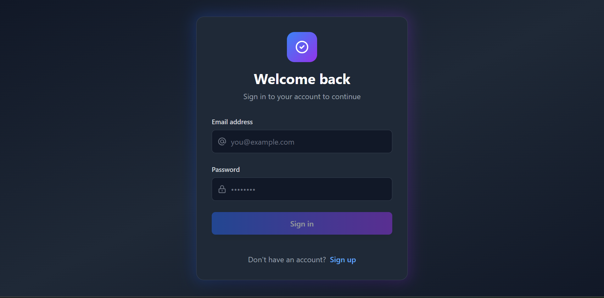
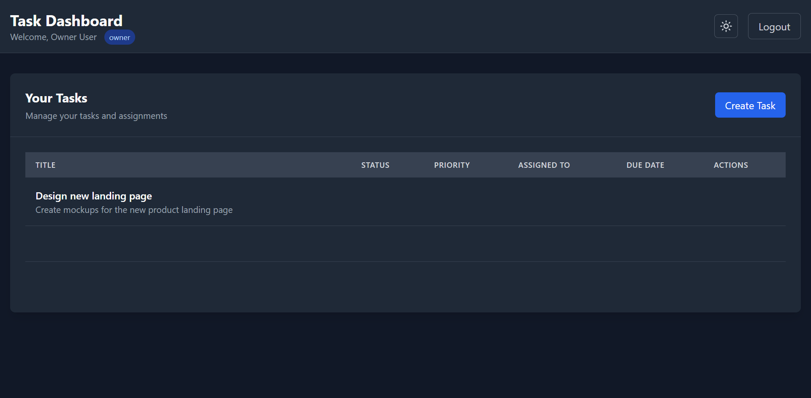
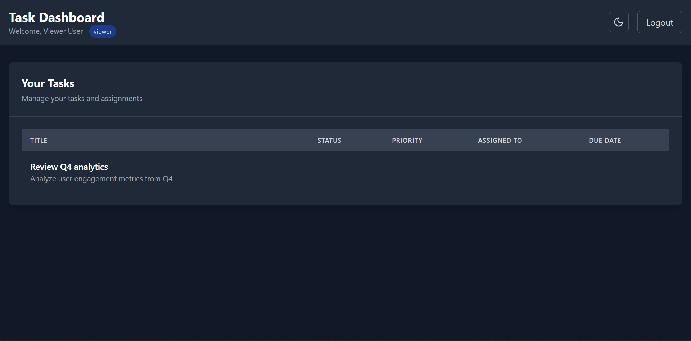

# Secure Task Management System with RBAC

A full-stack task management application with Role-Based Access Control (RBAC), JWT authentication, audit logging, project analytics (EVM/CPM), anomaly detection, and Angular Material UI.

---

## Overview

This project implements a multi-tenant task management system with a focus on security and authorization. The backend enforces granular, permission-based access control at the route level using NestJS guards and custom decorators. Every user action is recorded in an audit log with IP address, user agent, and metadata — accessible only to privileged roles.

---

## Screenshots

| Login | Owner Dashboard | Viewer Dashboard |
|---|---|---|
|  |  |  |

---

## Table of Contents

- [Tech Stack](#tech-stack)
- [Architecture](#architecture)
- [Quick Start](#quick-start)
- [RBAC System](#rbac-system)
- [API Reference](#api-reference)
- [Implementation Details](#implementation-details)
- [Database Schema](#database-schema)
- [Testing Guide](#testing-guide)
- [Production Considerations](#production-considerations)

---

## Tech Stack

| Layer | Technology |
|---|---|
| Backend | NestJS 10, TypeORM, Passport JWT, bcrypt |
| Frontend | Angular 20, Angular Material, Angular CDK, Cytoscape |
| Database | PostgreSQL + TypeORM migrations |
| Build System | NX 19 Monorepo |
| Language | TypeScript |

---

## Architecture

### NX Monorepo Structure

```
├── api/                                # NestJS Backend (Port 3333)
│   └── src/
│       ├── auth/                       # JWT authentication & guards
│       │   ├── jwt.strategy.ts
│       │   ├── jwt-auth.guard.ts
│       │   ├── permissions.guard.ts
│       │   ├── permissions.decorator.ts
│       │   └── current-user.decorator.ts
│       ├── tasks/
│       │   ├── tasks.controller.ts
│       │   └── tasks.service.ts
│       ├── entities/
│       │   ├── user.entity.ts
│       │   ├── role.entity.ts
│       │   ├── permission.entity.ts
│       │   ├── task.entity.ts
│       │   ├── organization.entity.ts
│       │   └── audit-log.entity.ts
│       ├── database/seeds/
│       └── services/
│           └── audit.service.ts
├── dashboard/                          # Angular Frontend (Port 4200)
├── data/                               # Shared TypeScript interfaces
└── README.md
```

---

## Quick Start

**Prerequisites:** Node.js 18+, npm, Docker

```bash
# Install dependencies
npm install

# Start PostgreSQL
docker compose up -d postgres

# Configure env
cp .env.example .env

# Run DB migrations
npm run migration:run

# Start the backend API (http://localhost:3333/api)
npx nx serve api

# Seed the database (new terminal)
curl -X POST http://localhost:3333/api/seed

# Start the frontend (http://localhost:4200)
npx nx serve dashboard
```

### Test Credentials

| Role | Email | Password | Access |
|---|---|---|---|
| Owner | owner@techcorp.com | password123 | Full system access + user management |
| Admin | admin@techcorp.com | password123 | Task CRUD + audit logs |
| Manager | manager@techcorp.com | password123 | Task create/read/update + users:read + audit access |
| Member | member@techcorp.com | password123 | Task create/read/update (own assigned tasks only) |
| Viewer | viewer@techcorp.com | password123 | Read-only, assigned tasks only |

---

## RBAC System

### Role Hierarchy

```
┌─────────────────────────────────────────────────┐
│                    OWNER                        │
│  + All Permissions                              │
└─────────────────────────────────────────────────┘
                      │
                      ▼
┌─────────────────────────────────────────────────┐
│                    ADMIN                        │
│  + Task CRUD + user create/read/update          │
│  + Audit Log Access                             │
└─────────────────────────────────────────────────┘
                      │
                      ▼
┌─────────────────────────────────────────────────┐
│                   MANAGER                       │
│  + tasks:create/read/update                     │
│  + users:read + audit:read                      │
└─────────────────────────────────────────────────┘
                      │
                      ▼
┌─────────────────────────────────────────────────┐
│                   MEMBER                        │
│  + tasks:create/read/update                     │
│  - Limited to own assigned tasks                │
└─────────────────────────────────────────────────┘
                      │
                      ▼
┌─────────────────────────────────────────────────┐
│                   VIEWER                        │
│  + Read assigned tasks only                     │
└─────────────────────────────────────────────────┘
```

### Permission Matrix

| Permission | Owner | Admin | Manager | Member | Viewer |
|---|---|---|---|---|---|
| tasks:create | Yes | Yes | Yes | Yes | No |
| tasks:read | Yes | Yes | Yes | Own only | Assigned only |
| tasks:update | Yes | Yes | Yes | Own only | No |
| tasks:delete | Yes | Yes | Yes | No | No |
| users:create | Yes | Yes | No | No | No |
| users:read | Yes | Yes | Yes | No | Yes (limited) |
| users:update | Yes | Yes | No | No | No |
| users:delete | Yes | No | No | No | No |
| audit:read | Yes | Yes | Yes | No | No |

### Authorization Flow

1. User authenticates → JWT issued containing user ID
2. On each request, JWT strategy loads user with role and permissions
3. `PermissionsGuard` checks the required permission against the user's role
4. On success, the action is recorded in the audit log with full metadata
5. Data queries are scoped to the user's organization

---

## API Reference

**Base URL:** `http://localhost:3333/api`

All task and audit endpoints require `Authorization: Bearer <token>`.

### Auth

```bash
POST /auth/login
POST /auth/register
POST /auth/refresh
POST /auth/logout
```

### Tasks

```bash
GET    /tasks          # Owner/Admin: all org tasks | Viewer: assigned only
GET    /tasks/:id
POST   /tasks          # Requires tasks:create
PUT    /tasks/:id      # Requires tasks:update
DELETE /tasks/:id      # Requires tasks:delete
```

### Projects / Planning APIs

```bash
GET /projects/:id/evm              # Earned Value metrics (PV, EV, AC, SPI, CPI, EAC)
GET /projects/:id/critical-path    # CPM output + cycle detection (400 on cycle)
GET /projects/:id/resource-leveling
```

### Security APIs

```bash
GET /security/alerts               # Owner only — persisted HIGH-risk sessions
PATCH /security/alerts/:id/reviewed
```

### Analytics & Comments

```bash
GET /analytics                     # Requires audit:read
GET /tasks/:taskId/comments        # Requires tasks:read
POST /tasks/:taskId/comments       # Requires tasks:update
```

### Tasks (WBS)

```bash
GET /tasks?tree=true               # Nested task hierarchy
```

### Audit Logs

```bash
GET /audit-log         # Requires audit:read (Owner/Admin only)
                       # Returns last 100 entries for the organization
```

### Error Responses

```json
{ "statusCode": 401, "message": "Unauthorized" }
{ "statusCode": 403, "message": "You need the following permissions: tasks:create" }
{ "statusCode": 404, "message": "Task not found" }
```

---

## Implementation Details

### Permission Guard

```typescript
@Controller('tasks')
@UseGuards(JwtAuthGuard, PermissionsGuard)
export class TasksController {
  @Get()
  @Permissions('tasks:read')
  findAll(@CurrentUser() user: User) {
    return this.tasksService.findAll(user);
  }
}
```

### Organization Isolation

```typescript
// Viewers see only their assigned tasks
if (user.role.name === 'viewer') {
  return this.taskRepo.find({
    where: {
      assignedToId: user.id,
      organizationId: user.organizationId
    }
  });
}

// Owners and Admins see all org tasks
return this.taskRepo.find({
  where: { organizationId: user.organizationId }
});
```

### Audit Logging

```typescript
await this.auditService.log({
  action: 'task:create',
  resource: 'task',
  resourceId: task.id,
  user: currentUser,
  ipAddress: request.ip,
  userAgent: request.headers['user-agent'],
  metadata: { title: task.title }
});
```

---

## Database Schema

```sql
organizations    (id, name, description, createdAt, updatedAt)
roles            (id, name, description)
permissions      (id, name, description)
role_permissions (roleId, permissionId)
users            (id, email, password, name, roleId, organizationId, refreshToken, refreshTokenExpiry)
tasks            (id, title, description, status, priority, dueDate, assignedToId, createdById, organizationId)
audit_logs       (id, action, resource, resourceId, userId, ipAddress, userAgent, metadata, createdAt)
```

---

## Testing Guide

```bash
# Seed the database
curl -X POST http://localhost:3333/api/seed

# Login as Owner and capture token
TOKEN=$(curl -s -X POST http://localhost:3333/api/auth/login \
  -H "Content-Type: application/json" \
  -d '{"email":"owner@techcorp.com","password":"password123"}' \
  | jq -r '.access_token')

# List all tasks
curl -s http://localhost:3333/api/tasks -H "Authorization: Bearer $TOKEN" | jq

# Create a task
curl -s -X POST http://localhost:3333/api/tasks \
  -H "Authorization: Bearer $TOKEN" \
  -H "Content-Type: application/json" \
  -d '{"title":"Test Task","status":"pending","priority":"high"}' | jq

# View audit logs
curl -s http://localhost:3333/api/audit-log -H "Authorization: Bearer $TOKEN" | jq

# Test Viewer restrictions
VIEWER_TOKEN=$(curl -s -X POST http://localhost:3333/api/auth/login \
  -H "Content-Type: application/json" \
  -d '{"email":"viewer@techcorp.com","password":"password123"}' \
  | jq -r '.access_token')

# Returns 403 — Viewer cannot create tasks
curl -s -X POST http://localhost:3333/api/tasks \
  -H "Authorization: Bearer $VIEWER_TOKEN" \
  -H "Content-Type: application/json" \
  -d '{"title":"Should Fail"}' | jq

# Returns 403 — Viewer cannot access audit logs
curl -s http://localhost:3333/api/audit-log -H "Authorization: Bearer $VIEWER_TOKEN" | jq
```

---

## Defense & Aerospace Alignment

This system implements **Earned Value Management (EVM)** metrics—SPI, CPI, and EAC—aligned with **DFARS 234.203** reporting expectations for contractor performance measurement. **Critical Path Method (CPM)** dependency graphs mirror scheduling workflows used in NASA and Lockheed Martin program offices: topological ordering, float calculation, and critical-path highlighting support what-if analysis before slip impacts milestones.

## Algorithms

### EVM (per project, with WBS roll-up)

```
PV = Σ(budgetHours) × (daysElapsed / totalProjectDays)
EV = Σ(budgetHours × completionPercent / 100)
AC = Σ(actualHours)
SPI = EV / PV
CPI = EV / AC
EAC = AC + (PV - EV) / CPI   (when CPI > 0)
```

Subtasks roll up to parent WBS nodes before project-level aggregation.

### CPM (topological sort + float)

```
1. Build adjacency list from task_dependencies
2. Kahn's algorithm → topological order (400 if cycle)
3. Forward pass: ES = max(EF of predecessors), EF = ES + duration
4. Backward pass: LF = min(LS of successors), LS = LF - duration
5. Float = LS - ES; float = 0 → critical path
```

Implements EVM metrics (SPI/CPI/EAC) aligned with DFARS 234.203 requirements.

## Production Considerations

- Use PostgreSQL via `docker compose up -d postgres`; set `DB_SYNCHRONIZE=false` and run `npm run migration:run`
- Credentials: `DB_HOST`, `DB_PORT`, `DB_USER`, `DB_PASSWORD`, `DB_NAME`, `JWT_SECRET`, `REFRESH_TOKEN_TTL_DAYS`
- Access tokens: 15 minutes; refresh tokens: bcrypt-hashed on `users`, 7-day TTL, rotated on each refresh
- All schema changes via TypeORM migrations under `api/src/database/migrations/`
- EVM, WBS (`?tree=true`), CPM, priority aging, security alerts (`security_alerts` table), and resource leveling are implemented
- Angular Material UI with CDK Kanban; Tailwind removed from global styles

---

## Author

**Farhan Tahmid** — Software Engineer

[GitHub](https://github.com/tahmidft)

---

## License

This project is for demonstration purposes.

