# Nexus PM

**Mission-critical project intelligence** — a multi-tenant project workspace with role-based access, Kanban delivery, earned-value metrics, critical-path scheduling, and a compliance-grade audit trail.

| | |
|---|---|
| **Live app** | [nexus-pm-five.vercel.app](https://nexus-pm-five.vercel.app) |
| **API** | [enterprise-task-manager-api.onrender.com/api](https://enterprise-task-manager-api.onrender.com/api) |
| **Health** | [/api/health](https://enterprise-task-manager-api.onrender.com/api/health) |
| **Try it** | Quick-login chips on the sign-in screen, or `owner@techcorp.com` / `password123` |

> Pivoted from an earlier permissions-focused task CRUD demo into a fuller PM surface: boards, WBS, CPM/Gantt, EVM, analytics, team, security alerts, and audit.

---

## Screenshots

Captured from the live demo (Owner / Viewer).

| Login — demo role chips | Owner dashboard — EVM + CPM + WBS |
|---|---|
| 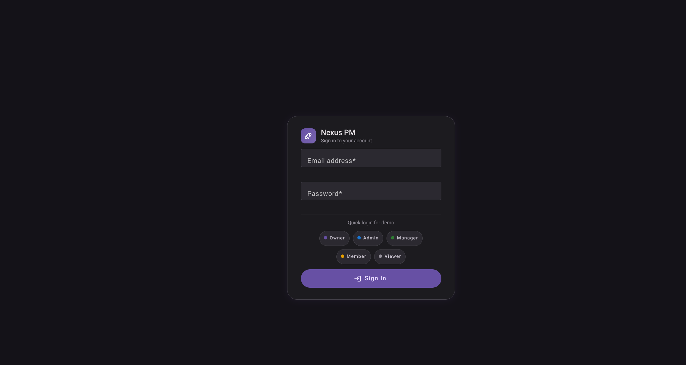 | 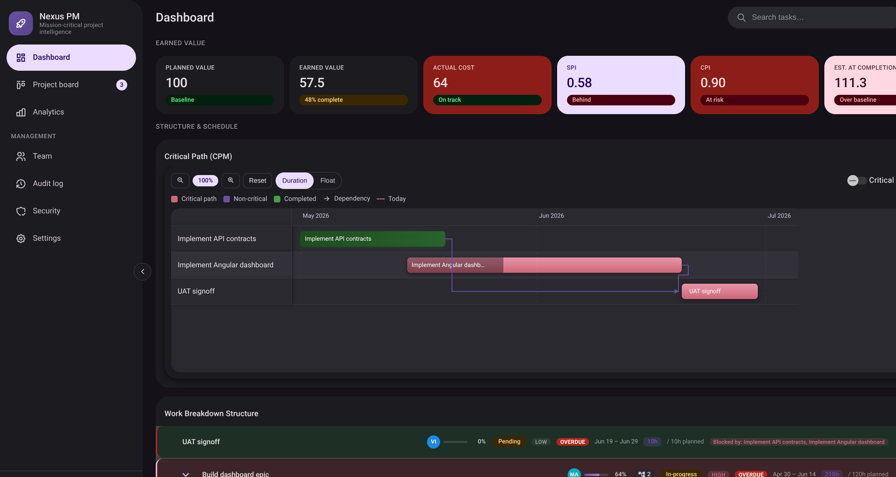 |

| Critical Path (CPM) Gantt | Viewer dashboard — scoped data |
|---|---|
| 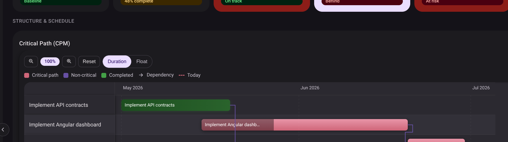 | 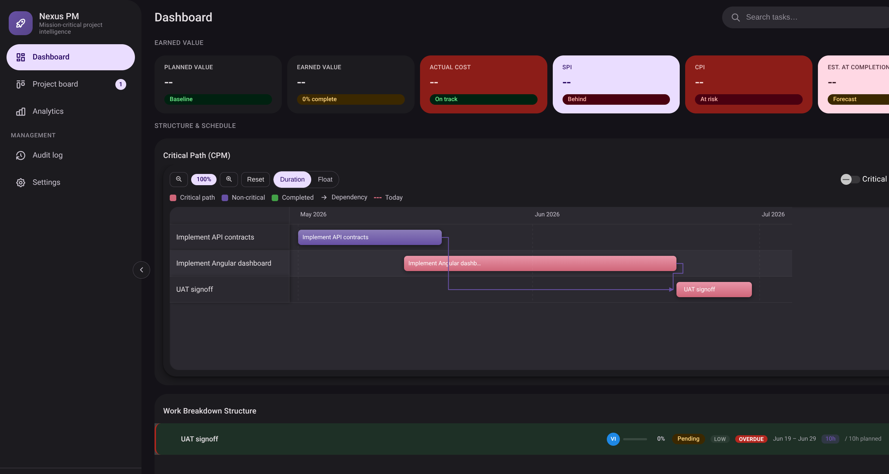 |

| Kanban board | Analytics — Chart.js |
|---|---|
| 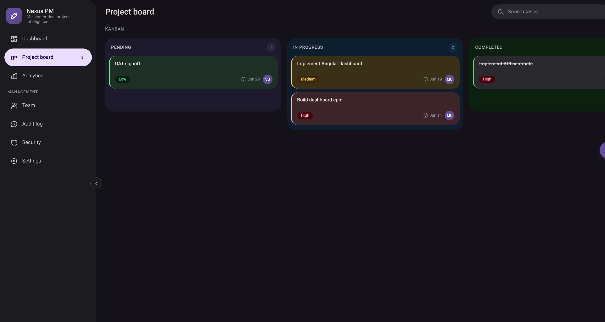 | 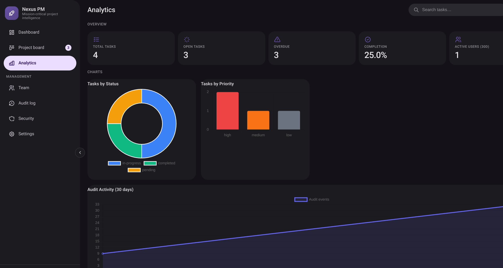 |

| Audit log | Team directory |
|---|---|
| 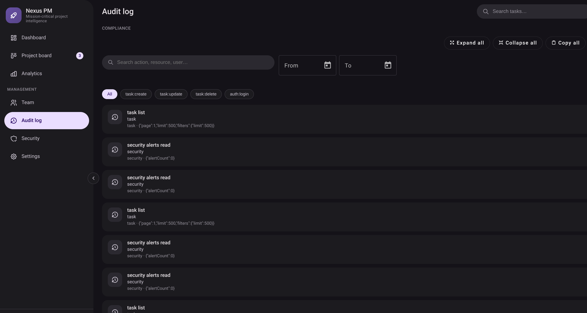 | 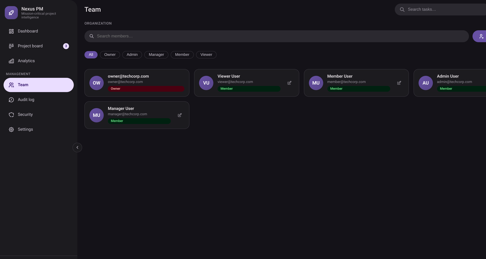 |

| Security alerts (Owner) |
|---|
| 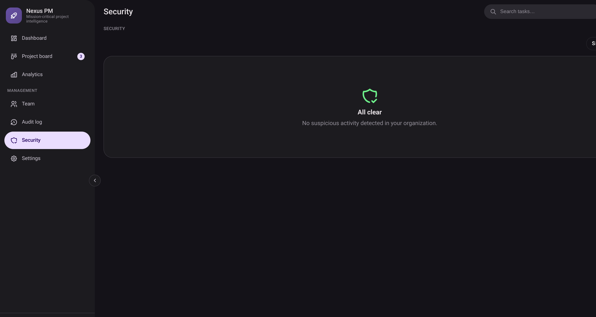 |

**RBAC in the UI:** Owner sees Team + Security and live EVM numbers. Viewer loses those nav items, sees only assigned work (e.g. one board card), and EVM cards render as `--`.

---

## What you get

| Capability | What it does |
|---|---|
| **Earned Value (EVM)** | PV, EV, AC, SPI, CPI, EAC cards on the dashboard with tone pills (Behind / At risk / Over baseline) |
| **Critical Path (CPM)** | Interactive Gantt: duration vs float modes, critical-only toggle, dependency edges, today line, export/fullscreen |
| **Work Breakdown Structure** | Nested tree with drag reorder, progress, blockers, overdue badges, budget vs actual hours |
| **Kanban board** | Pending → In progress → Completed columns, priority chips, filters, task search |
| **Analytics** | KPI strip + Chart.js donut (status), bars (priority), 30-day audit activity line |
| **Audit log** | Searchable, date-filtered, action-chip filters; expandable metadata; copy/export |
| **Team** | Org member cards, role filters, invite (permission-gated) |
| **Security** | Owner-only HIGH-risk session alerts; demo “Simulate alert” |
| **Auth** | JWT access (15m) + hashed refresh tokens with rotation |

Demo tenant: **TechCorp Inc** with a seeded **Website Revamp** style project (API contracts → Angular dashboard → UAT signoff).

---

## Architecture

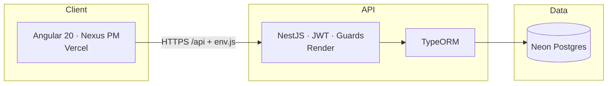
```mermaid
flowchart LR
  subgraph Client
    A[Angular 20 · Nexus PM<br/>Vercel]
  end
  subgraph API
    B[NestJS · JWT · Guards<br/>Render]
    C[TypeORM]
  end
  subgraph Data
    D[(Neon Postgres)]
  end
  A -->|HTTPS /api + env.js| B
  B --> C --> D
```

```
├── api/            NestJS API (port 3333)
├── dashboard/      Angular app — Nexus PM (port 4200)
├── data/           Shared TypeScript types
├── auth/           Shared auth helpers
├── docs/           README screenshots
├── docker-compose.yml
├── render.yaml
└── vercel.json
```

**Runtime config:** the dashboard loads `/env.js` so production can point at the Render API without rebuilding:

```js
window.__env = { API_URL: 'https://enterprise-task-manager-api.onrender.com/api' };
```

---

## Authorization model

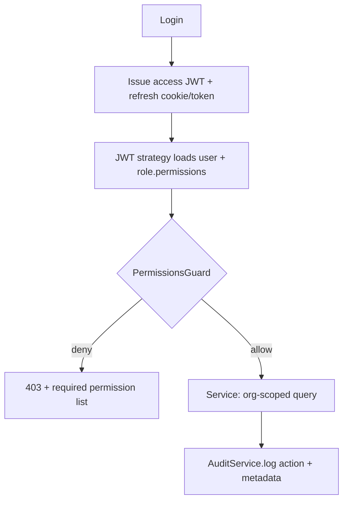
```mermaid
flowchart TD
  L[Login] --> T[Issue access JWT + refresh cookie/token]
  T --> R[JWT strategy loads user + role.permissions]
  R --> G{PermissionsGuard}
  G -->|deny| F[403 + required permission list]
  G -->|allow| S[Service: org-scoped query]
  S --> A[AuditService.log action + metadata]
```

### Roles (seed)

```
Owner → Admin → Manager → Member → Viewer
```

| Permission | Owner | Admin | Manager | Member | Viewer |
|---|---|---|---|---|---|
| `tasks:create` | ✓ | ✓ | ✓ | ✓ | |
| `tasks:read` | ✓ | ✓ | ✓ | own* | assigned |
| `tasks:update` | ✓ | ✓ | ✓ | own* | |
| `tasks:delete` | ✓ | ✓ | ✓ | | |
| `users:create` | ✓ | ✓ | | | |
| `users:read` | ✓ | ✓ | ✓ | | ✓ |
| `users:update` | ✓ | ✓ | | | |
| `users:delete` | ✓ | | | | |
| `audit:read` | ✓ | ✓ | ✓ | ✓ | ✓ |

\*Member task writes are scoped to work they own/are assigned; Viewer is read-only on assigned tasks. All queries stay inside the user’s `organizationId`.

### Demo accounts

Password for all: `password123`

| Role | Email |
|---|---|
| Owner | `owner@techcorp.com` |
| Admin | `admin@techcorp.com` |
| Manager | `manager@techcorp.com` |
| Member | `member@techcorp.com` |
| Viewer | `viewer@techcorp.com` |

---

## Planning mechanisms

### Earned Value Management

Implemented in `api/src/projects/project-math.ts` and exposed as `GET /projects/:id/evm`.

WBS parents **roll up** leaf `budgetHours`, `actualHours`, and earned value from children (`project-math.ts` + `ProjectsService.getEvm`):

```
EV_leaf = budgetHours × (completionPercent / 100)
PV      = totalBudgetHours × (daysElapsed / totalProjectDays)
AC      = Σ actualHours
SPI     = EV / PV          (1 when PV = 0)
CPI     = EV / AC          (1 when AC = 0)
EAC     = BAC / CPI        (BAC = totalBudgetHours; when CPI > 0)
```

Dashboard cards map SPI/CPI into status pills (e.g. SPI 0.58 → **Behind**, CPI 0.90 → **At risk**). Roles below Manager see placeholders (`--`).

### Critical Path Method

Same module, `GET /projects/:id/critical-path`. WBS parents are skipped; only leaf/work tasks are scheduled.

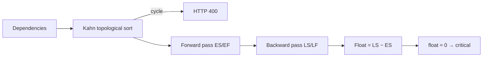
```mermaid
flowchart LR
  D[Dependencies] --> K[Kahn topological sort]
  K -->|cycle| E[HTTP 400]
  K --> F[Forward pass ES/EF]
  F --> B[Backward pass LS/LF]
  B --> Z[Float = LS − ES]
  Z --> C[float ≈ 0 → critical]
```

- **Duration** = calendar days between `startDate` and `dueDate`, else fallback to `budgetHours` as day-counts  
- UI: `app-cpm-gantt-chart` — zoom, duration/float modes, critical filter, dependency arrows, today marker  
- Critical edges only connect critical → critical successors

### Priority aging

Nightly cron (`PriorityAgingService`): pending **low** tasks escalate to **medium** after `LOW_TO_MEDIUM_DAYS` (default 5); **medium** → **high** after additional `MEDIUM_TO_HIGH_DAYS` (default 3). Each escalation is audited as `task:priority-escalated`.

### Analytics charts

`GET /analytics` feeds Chart.js on `/analytics`:

1. **Tasks by Status** — doughnut  
2. **Tasks by Priority** — bar  
3. **Audit Activity (30 days)** — line  

---

## Data model

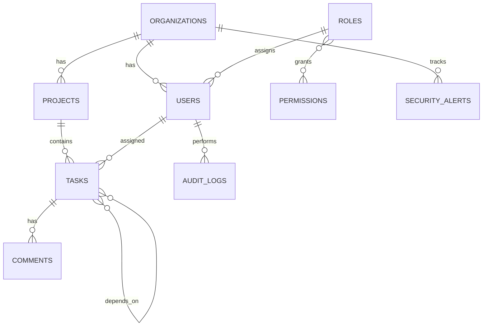
```mermaid
erDiagram
  ORGANIZATIONS ||--o{ USERS : has
  ORGANIZATIONS ||--o{ PROJECTS : has
  ROLES ||--o{ USERS : assigns
  ROLES }o--o{ PERMISSIONS : grants
  PROJECTS ||--o{ TASKS : contains
  TASKS ||--o{ TASKS : parent_child
  TASKS }o--o{ TASKS : depends_on
  USERS ||--o{ TASKS : assigned
  USERS ||--o{ AUDIT_LOGS : performs
  ORGANIZATIONS ||--o{ SECURITY_ALERTS : tracks
  TASKS ||--o{ COMMENTS : has
```

Core task fields: `status`, `priority`, `startDate`, `dueDate`, `budgetHours`, `actualHours`, `completionPercent`, `parentTaskId`, project + org FKs.

---

## API surface

Base: `http://localhost:3333/api` (prod: Render URL above).  
Authenticated routes: `Authorization: Bearer <access_token>`.

```bash
# Auth
POST /auth/login | /auth/register | /auth/refresh | /auth/logout

# Tasks & WBS
GET    /tasks
GET    /tasks?tree=true
GET|PUT|DELETE /tasks/:id
POST   /tasks
GET|POST /tasks/:taskId/comments

# Planning
GET /projects/:id/evm
GET /projects/:id/critical-path
GET /projects/:id/resource-leveling

# Governance
GET /audit-log
GET /analytics
GET /security/alerts                  # owner
PATCH /security/alerts/:id/reviewed

# Bootstrap
POST /seed
GET  /health
```

---

## Quick start (local)

**Prerequisites:** Node.js 18+, npm, Docker

```bash
npm install
docker compose up -d postgres
cp .env.example .env
npm run migration:run

npx nx serve api          # http://localhost:3333/api
curl -X POST http://localhost:3333/api/seed
npx nx serve dashboard    # http://localhost:4200
```

### Smoke test

```bash
TOKEN=$(curl -s -X POST http://localhost:3333/api/auth/login \
  -H 'Content-Type: application/json' \
  -d '{"email":"owner@techcorp.com","password":"password123"}' \
  | jq -r '.access_token')

curl -s http://localhost:3333/api/tasks -H "Authorization: Bearer $TOKEN" | jq 'length'
curl -s http://localhost:3333/api/audit-log -H "Authorization: Bearer $TOKEN" | jq 'length'
```

---

## Production

| Piece | Host |
|---|---|
| Dashboard | Vercel project **`nexus-pm`** |
| API | Render Node web service |
| Database | Neon Postgres via `DATABASE_URL` |

Key env (see `.env.example` / `render.yaml`):

- `DATABASE_URL` or `DB_*`, `DB_SSL`, `DB_SYNCHRONIZE`
- `JWT_SECRET`, `JWT_EXPIRATION`, `REFRESH_TOKEN_TTL_DAYS`
- `CORS_ORIGIN` — include the Vercel origin
- Start command: `node api/dist/main.js`

Free Render tiers cold-start in ~30–60s after idle; wake `/api/health` first if login hangs.

`main` is protected by a GitHub **ruleset** (PR required, no force-push, no branch deletion).

### Demo / portfolio caveats

| Area | Notes |
|---|---|
| Team invite / edit | UI exists; there is no `/users` CRUD API yet — roster is inferred from assignees |
| Security “Simulate alert” | Client-only mock; real alerts come from audit-session scoring on the API |
| Settings (theme, defaults, aging days) | Mostly `localStorage`; server aging uses env vars |
| JWT refresh | Backend rotates refresh tokens; the dashboard does not auto-refresh on 401 yet |
| WebSockets / task comments | Gateway and comments API exist; dashboard does not surface live sockets or a comments UI |
| Email | Logs a stub unless `RESEND_API_KEY` is set |

---

## Author

**Farhan Tahmid** — [GitHub](https://github.com/tahmidft)

Portfolio / demo project — not a production SLA offering.
