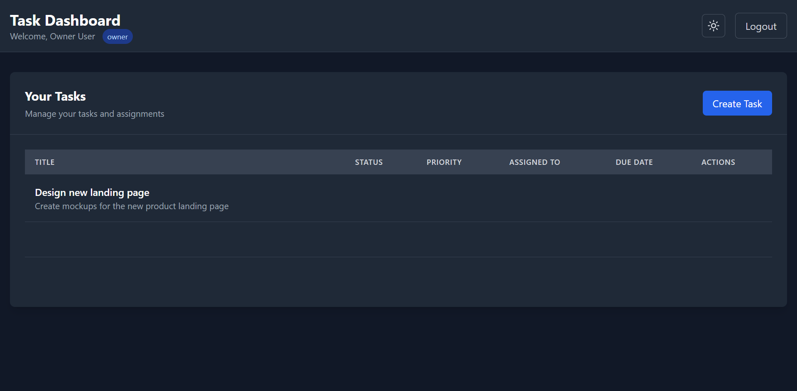
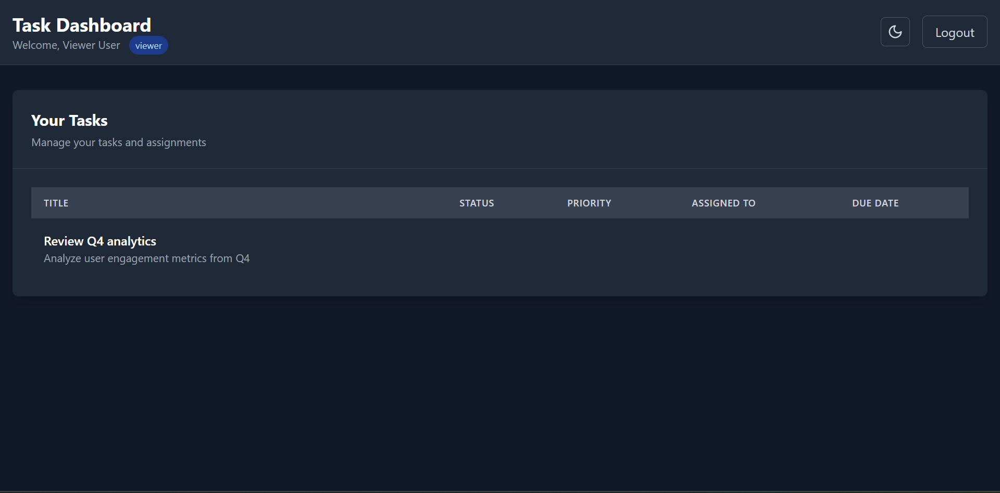

# Nexus PM

Enterprise project management with role-based access, Kanban boards, critical-path scheduling, and full audit trails.

| | |
|---|---|
| **Live app** | [nexus-pm-five.vercel.app](https://nexus-pm-five.vercel.app) |
| **API** | [enterprise-task-manager-api.onrender.com/api](https://enterprise-task-manager-api.onrender.com/api) |
| **Health** | [/api/health](https://enterprise-task-manager-api.onrender.com/api/health) |
| **Demo login** | `owner@techcorp.com` / `password123` |

> **Note:** The repository name (`enterprise-role-based-task-manager`) is historical. The product is **Nexus PM** — a pivot from a permissions-focused task CRUD demo into a fuller PM workspace (boards, planning math, team, security, and analytics).

---

## What it is

Nexus PM is a multi-tenant project workspace for teams that need:

- **RBAC** — Owner, Admin, Manager, Member, and Viewer with permission-scoped APIs
- **Kanban board** — drag-and-drop status columns, filters, and task search
- **Planning** — WBS-aware tasks, Critical Path Method (CPM), Gantt-style timeline, and Earned Value (EVM) metrics
- **Governance** — organization-scoped audit logs, JWT auth with refresh rotation, and owner security alerts
- **Ops surface** — dashboard KPIs, analytics, team directory, and settings

The UI is Angular Material; the API is NestJS + TypeORM on PostgreSQL, managed as an NX monorepo.

---

## Screenshots

| Login | Owner dashboard | Viewer dashboard |
|---|---|---|
|  |  |  |

---

## Stack

| Layer | Choice |
|---|---|
| Frontend | Angular 20, Angular Material / CDK |
| Backend | NestJS, Passport JWT, bcrypt |
| Data | PostgreSQL, TypeORM (migrations) |
| Monorepo | NX |
| Production | Vercel (dashboard) · Render (API) · Neon (Postgres) |

---

## App surfaces

| Route | Purpose |
|---|---|
| `/dashboard` | KPIs, project overview, planning widgets |
| `/board` | Kanban board with filters and search |
| `/analytics` | Org / project analytics |
| `/audit` | Permission-gated audit trail |
| `/security` | Owner security alerts |
| `/team` | Team directory (owner / admin / manager) |
| `/settings` | Account and workspace settings |

---

## Quick start (local)

**Prerequisites:** Node.js 18+, npm, Docker

```bash
npm install
docker compose up -d postgres
cp .env.example .env

npm run migration:run

# API → http://localhost:3333/api
npx nx serve api

# Seed (separate terminal)
curl -X POST http://localhost:3333/api/seed

# Dashboard → http://localhost:4200
npx nx serve dashboard
```

### Demo accounts

Same password for all roles: `password123`

| Role | Email | Access highlight |
|---|---|---|
| Owner | `owner@techcorp.com` | Full access + user management + security |
| Admin | `admin@techcorp.com` | Task CRUD, users, audit |
| Manager | `manager@techcorp.com` | Tasks + users:read + audit |
| Member | `member@techcorp.com` | Create / update own assigned tasks |
| Viewer | `viewer@techcorp.com` | Read assigned tasks only |

---

## RBAC

```
Owner → Admin → Manager → Member → Viewer
```

| Permission | Owner | Admin | Manager | Member | Viewer |
|---|---|---|---|---|---|
| `tasks:create` | ✓ | ✓ | ✓ | ✓ | |
| `tasks:read` | ✓ | ✓ | ✓ | own | assigned |
| `tasks:update` | ✓ | ✓ | ✓ | own | |
| `tasks:delete` | ✓ | ✓ | ✓ | | |
| `users:create` | ✓ | ✓ | | | |
| `users:read` | ✓ | ✓ | ✓ | | limited |
| `users:update` | ✓ | ✓ | | | |
| `users:delete` | ✓ | | | | |
| `audit:read` | ✓ | ✓ | ✓ | ✓ | ✓ |

Flow: login issues a JWT → strategy loads role + permissions → `PermissionsGuard` enforces route metadata → successful actions are audit-logged → queries stay org-scoped.

---

## API (local base: `http://localhost:3333/api`)

Authenticated routes expect `Authorization: Bearer <access_token>`.

```bash
# Auth
POST /auth/login
POST /auth/register
POST /auth/refresh
POST /auth/logout

# Tasks
GET    /tasks
GET    /tasks?tree=true          # WBS tree
GET    /tasks/:id
POST   /tasks
PUT    /tasks/:id
DELETE /tasks/:id
GET|POST /tasks/:taskId/comments

# Projects / planning
GET /projects/:id/evm
GET /projects/:id/critical-path
GET /projects/:id/resource-leveling

# Security (owner)
GET   /security/alerts
PATCH /security/alerts/:id/reviewed

# Analytics & audit
GET /analytics
GET /audit-log
```

### Smoke test

```bash
curl -X POST http://localhost:3333/api/seed

TOKEN=$(curl -s -X POST http://localhost:3333/api/auth/login \
  -H 'Content-Type: application/json' \
  -d '{"email":"owner@techcorp.com","password":"password123"}' \
  | jq -r '.access_token')

curl -s http://localhost:3333/api/tasks -H "Authorization: Bearer $TOKEN" | jq
curl -s http://localhost:3333/api/audit-log -H "Authorization: Bearer $TOKEN" | jq 'length'
```

---

## Planning algorithms

### Earned Value (EVM)

```
PV  = Σ(budgetHours) × (daysElapsed / totalProjectDays)
EV  = Σ(budgetHours × completionPercent / 100)
AC  = Σ(actualHours)
SPI = EV / PV
CPI = EV / AC
EAC = AC + (PV - EV) / CPI   when CPI > 0
```

Subtasks roll up through WBS parents before project aggregation.

### Critical Path (CPM)

1. Build the dependency graph  
2. Kahn topological sort (HTTP 400 on cycle)  
3. Forward pass → earliest start / finish  
4. Backward pass → latest start / finish  
5. Float = `LS - ES`; zero float = critical path  

---

## Production layout

| Piece | Host |
|---|---|
| Dashboard | Vercel project **`nexus-pm`** |
| API | Render web service |
| Database | Neon Postgres (`DATABASE_URL`) |

Useful env vars (see `.env.example` and `render.yaml`):

- `DATABASE_URL` or `DB_*` — Postgres
- `JWT_SECRET`, `JWT_EXPIRATION`, `REFRESH_TOKEN_TTL_DAYS`
- `CORS_ORIGIN` — comma-separated allowed origins (include the Vercel URL)
- `DB_SYNCHRONIZE` — `false` + migrations for durable prod; demo may use `true` on first boot
- Dashboard runtime API URL via `dashboard/public/env.js` (`window.__ENV__.API_URL`)

Render start command: `node api/dist/main.js`  
Cold starts on free Render can take ~30–60s on the first request after idle.

---

## Repo layout

```
├── api/                 NestJS API (port 3333)
├── dashboard/           Angular app — Nexus PM (port 4200)
├── data/                Shared TypeScript types
├── auth/                Shared auth helpers
├── docker-compose.yml   Local Postgres
├── render.yaml          API deploy blueprint
└── vercel.json          SPA rewrites / env.js caching
```

---

## Author

**Farhan Tahmid** — [GitHub](https://github.com/tahmidft)

Demo / portfolio project. Not a production SLA offering.
